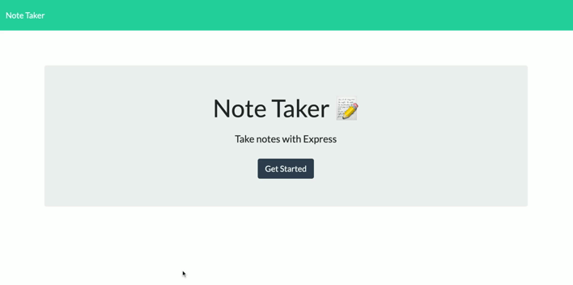

# Note Taker


## _Links_

Deployed URL: https://note-taker-kp1.herokuapp.com

Github Code URL: https://github.com/kpegeder/note-taker

## Description

An application that can be used to write, save, and delete notes. This application will use an express backend and save and retrieve note data from a JSON file.

For users that need to keep track of a lot of information, it's easy to forget or be unable to recall something important. Being able to take persistent notes allows users to have written information available when needed.

## Table of Contents

- [Installation](#installation)
- [Usage](#usage)
- [Test](#test)
- [License](#license)
- [Questions](#questions)

## Installation

To install necessary dependencies, run the following command:

```
npm i
```

## Usage

Instructions to use the program are shown below

1. Run node server.js



## Test

To run tests, run the following command:

```
npm test
```

## Contributing

[Kalen Pegeder](https://github.com/kpegeder)

## License

Licensed under the MIT license.

## Questions

If you have any additional questions about the applictaion, you can contact through [email](mailto:k.pegeder@gmail.com).
You can see more of my work on [GitHub](https://github.com/kpegeder).
